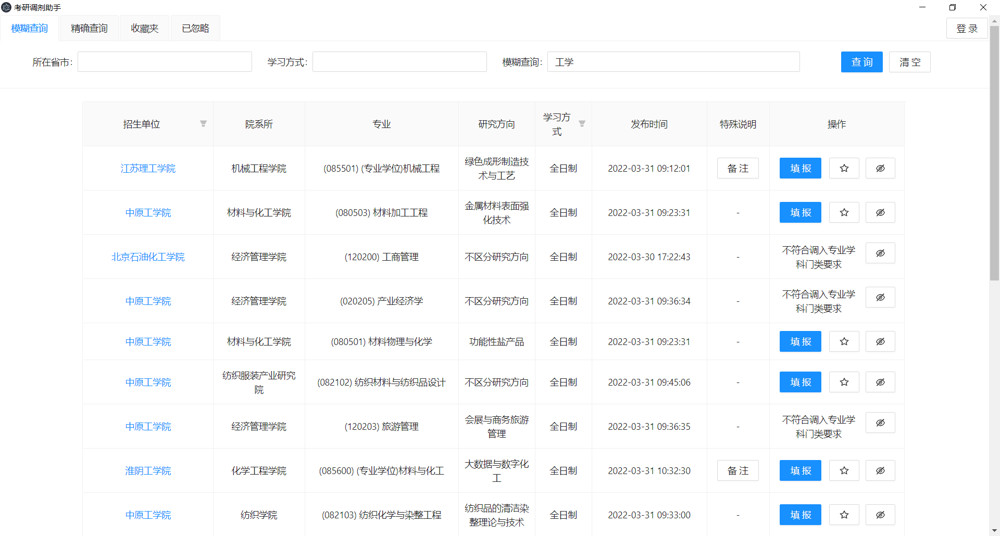

# ky-tiaoji-helper

考研调剂助手，祝各位考生早日上岸

📦️[下载安装包](https://github.com/Chalkim/ky-tiaoji-helper/releases)

## 使用

- 启动软件，点击右上角登录按钮
- 弹出学信网登录界面，登录成功后转到学信网官网，此时该窗口可以关闭
- 在查询界面输入相应字段查询
- 表格表头可以进行筛选
- 每行记录可以选择加入收藏夹或忽略名单
- 加入收藏夹或忽略名单的记录不会在查询结果中再次出现
- 收藏夹及忽略名单提供简单的管理功能

## 截图

如果这个软件有帮到你，请在右上角点一个免费的Star，谢谢